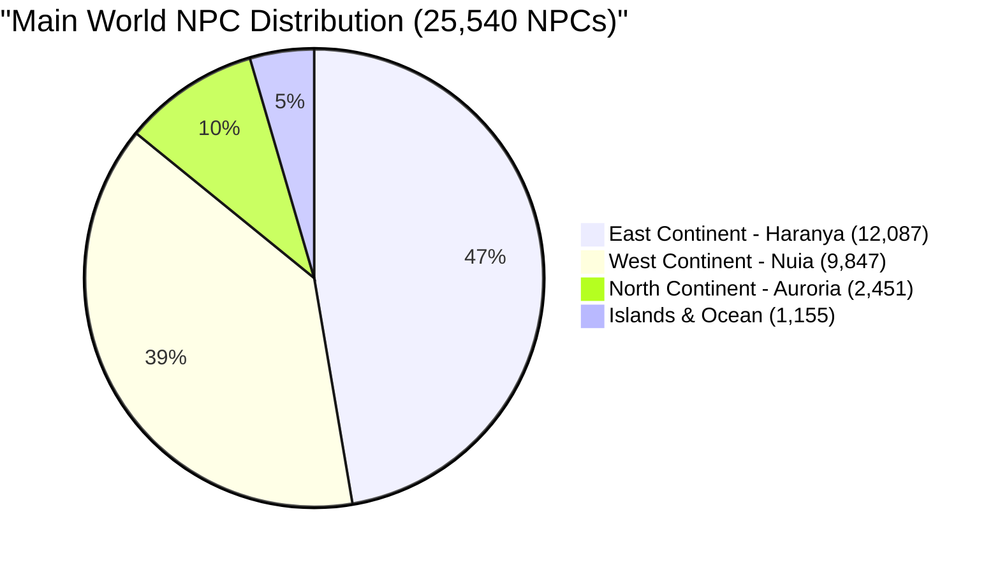

# World, Continents, Races & Mirage Isle Reference

This document records the official reference analysis of the game world in **AAEmu (ArcheAge 1.2 `r208022`)**, detailing the playable races, continental zones, NPC populations, ocean islands, and the architecture of Mirage Isle.

---

## 1. World Overview & Entity Scale

The server simulation spans multiple parallel world environments. The persistent shared world (`main_world`) and the commercial showcase instance (`arche_mall_world`) host over **25,900 NPCs** and **43,800 Doodads**:

| World Instance | Internal Identifier | Zone ID / Key | Active NPCs | Active Doodads | Primary Role |
| :--- | :--- | :--- | :---: | :---: | :--- |
| **Main World** | `main_world` | Zones 1–182, 184–218 | **25,540** | **42,656** | Persistent continents, wilderness, towns, and high seas. |
| **Mirage Isle** | `arche_mall_world` | Zone 183 (Key 260) | **418** | **1,196** | Showcase instance: full-scale housing, vehicles, gliders, designs. |
| **Dungeons** | `instance_*` (16 instances) | Various | Dynamic | Dynamic | Sharpwind Mines, Burnt Castle, Hadir Farm, Serpentis, etc. |

---

## 2. Playable Factions & Races

ArcheAge 1.2 divides the player base into two warring continental factions, each comprising two canonical races:

```text
               ┌──────────────── Nuian (Race.Nuian = 1) ──► Starter: Solzreed Peninsula
Nuia Alliance ─┤
(West Continent)└──────────────── Elf (Race.Elf = 4) ────────► Starter: Gweonid Forest

               ┌──────────────── Hariharan (Race.Hariharan = 5) ──► Starter: Arcum Iris
Haranya Alliance┤
(East Continent)└──────────────── Ferre / Firran (Race.Ferre = 6) ─► Starter: Falcorth Plains
```

### Race Details & Code Representation ([`Race.cs`](file:///root/aaemu-dev/AAEmu.Game/Models/Game/Char/Race.cs))
* **`Nuian = 1`**: West human race with defensive blessing and short-cooldown resurrection buff.
* **`Elf = 4`**: West woodland race with swimming speed bonus and extended breath duration.
* **`Hariharan = 5`**: East human race (Harani) with reduced recall cooldown and faster tree/crop harvesting.
* **`Ferre = 6`**: East feline race (Firran) with claw climbing bonus and reduced fall damage.

### Unplayable Stubs in 1.2
`Fairy = 2`, `Dwarf = 3`, `Returned = 7`, and `Warborn = 8` exist in the `Race` enum definition, but lack complete 1.2 client animation meshes, rigging, and voice lines. They are not playable in 1.2 `r208022`.

### PlayerBot Race Provisioning
* **Engine Provisioner:** [`HeadlessSession.Provision(account, name, race, gender, level)`](file:///root/aaemu-dev/AAEmu.Game/Core/Managers/Bots/BotAdminService.cs#L101) accepts any valid `Race` and `Gender`.
* **Default GM Command:** `/bot add <name>` currently defaults to `Race.Nuian, Gender.Male`. Passing explicit race/gender parameters allows spawning Harani, Firran, or Elf bots in their respective native zones.

---

## 3. The Continents & Zone Distribution

The `main_world` features three major landmasses:



### A. West Continent: Nuia (~9,847 NPCs · 40.4%)
The traditional European medieval fantasy continent:
* **Starter Zones:**
  * **Solzreed Peninsula** (`w_solzreed`, Zone 9) — Nuian starting coastline and Crescent Throne.
  * **Gweonid Forest** (`w_gweonid_forest`, Zone 1) — Ancient Elven homeland and lake canopy.
* **Core Leveling Zones:**
  * **Lilyut Hills** (`w_lilyut_meadow`, Zone 11) — Rolling farmlands and Ronbann mine.
  * **Dewstone Plains** (`w_garangdol_plains`, Zone 7) — Rocky savannah, granite quarries, and road to Marianople.
  * **White Arden** (`w_white_forest`, Zone 10) — Dark birch forests and Birchkeep fortress.
  * **Marianople** (`w_marianople`, Zone 2) — Nuian faction capital city, arena, auction houses, and university.
  * **Two Crowns** (`w_two_crowns`, Zone 15) — Coastal seat of Nuian royalty, Ezna harbor.
  * **Cinderstone Moor** (`w_cross_plains`, Zone 14) — Volcanic craters, Burnt Castle, sulfur vents.
* **Contested & Endgame Zones:**
  * **Halcyona** (`w_golden_plains`, Zone 17) — Golden Plains, site of the Halcyona War faction battleground.
  * **Hellswamp** (`w_hell_swamp`, Zone 26) — Murky marshlands and Howling Abyss entrance.
  * **Sanddeep** (`w_long_sand`, Zone 27) — Tropical resort beaches, Blue Salt Brotherhood festival grounds.
  * **Airain Rock** (`w_bronze_rock`, Zone 19) — High mountain passes and airship lines.
  * **Karkasse Ridgelands** (`w_the_carcass`, Zone 12) — High-level dragon roost, wyverns, and Minotaur clans.

### B. East Continent: Haranya / Hariharalaya (~12,087 NPCs · 49.6%)
The Asian-inspired imperial and nomadic continent. **Has the highest density of spawned NPCs and quest hubs in the world:**
* **Starter Zones:**
  * **Arcum Iris** (`e_sunny_wilderness`, Zone 22) — Harani arid desert oasis, Parchsun settlement, sunstone mines.
  * **Falcorth Plains** (`e_falcony_plateau`, Zone 21) — High mountain Firran plateaus, Oxion Clan yurt camps, snow lions.
* **Core Leveling Zones:**
  * **Tigerspine Mountains** (`e_tiger_spine_mountains`, Zone 23) — Mechanical workshops, junkyards, cobalt mines.
  * **Mahadevi** (`e_mahadevi`, Zone 18) — Empress city, sprawling tropical rainforest, port to Villanelle.
  * **Sunrise Peninsula** (`e_sunrise_peninsula`, Zone 8) — Austera port, Haranya faction capital, seaside trade docks.
  * **Villanelle** (`e_singing_land`, Zone 25) — Cherry blossom canals, Lutesong Harbor, pagoda palaces.
  * **Silent Forest** (`e_ancient_forest`, Zone 24) — Haunted evergreen woods and Hadir Farm.
* **Contested & Endgame Zones:**
  * **Ynystere** (`e_ynystere`, Zone 6) — Walled fortress city of Caernord, coastal PvP port, and fortress siege hubs.
  * **Rookborne Basin** (`e_lokas_checkers`, Zone 5) — Towering pillar mountains and river rapids.
  * **Windscour Savannah** (`e_steppe_belt`, Zone 3) — Sprawling savannah wildlife, lion prides, nomadic tent posts.
  * **Perinoor Ruins** (`e_ruins_of_hariharalaya`, Zone 4) — Ancient imperial tomb ruins, undead armies, terracotta soldiers.
  * **Hasla** (`e_hasla`, Zone 20) — Veroe mountain town, bamboo valleys, Hasla token rift weapon crafting.

### C. North Continent: Auroria / Outlands (~2,451 NPCs · 10.1%)
The shattered northern continent, center of territorial guild wars and endgame sieges:
* **Territory & Castle Siege Zones:**
  * **Nuimari** (`o_nuimari`, Zone 149)
  * **Heedmar** (`o_seonyeokmari`, Zone 166)
  * **Marcala** (`o_salpimari`, Zone 148)
  * **Calmlands** (`o_rest_land`, Zone 167)
* **Conflict & Open Progression Zones:**
  * **Diamond Shores** (`o_shining_shore`, Zone 197) — Faction portals, Ayanad Library entrance, purification towers.
  * **Sungold Fields** (`o_land_of_sunlights`, Zone 193) — Flaming volcanic craters and Anthalon world boss rift.
  * **Exeloch** (`o_abyss_gate`, Zone 191) — Shadow rifts, Serpentis instance entrance.
  * **Mistmerrow** (`o_dew_plains`, Zone 218) — Bloodsands battlefield.
  * **Ayanad Library** (`o_library_1/2/3`, Zones 203–215) — 3-floor infinite dungeon tower.

---

## 4. Oceanic Islands & Maritime PvP

The open sea connects the continents via three deep-water oceanic zones (`s_golden_sea`, `s_crescent_sea`, `s_lostway_sea`):

* **Freedich Island (`s_freedom_island`, Zone 195 / Key 283):**
  * The central oceanic PvP trade hub in the middle of the Arcadian Sea.
  * Gold traders and Gilda Star traders exchange continental trade packs for maximum reward.
  * High-risk lawless ocean surrounded by deep-water sea monsters.
* **Pirate Island / Growlgate Isle (`s_pirate_island`, Zone 196 / Key 284):**
  * Located in the Castaway Strait (`s_lostway_sea`).
  * Capital of the Pirate Faction (infamy > 3,000).
  * Houses Pirate Captain Morpheus (level 50 raid boss), pirate vendors, grog taverns, and pirate jail.
* **Lost Island (`s_lost_island`, Zone 29):**
  * Isolated oceanic ruins and hidden dive spots between the West and East sea routes.

---

## 5. Mirage Isle (`arche_mall_world`, Zone 183 / Key 260)

Mirage Isle is a dedicated commercial showcase instance running continuously in parallel with the main world.

### System Architecture
* **Auto-Creation:** Configured in [`Configurations/Dungeons.json`](file:///root/aaemu-dev/AAEmu.Game/Configurations/Dungeons.json#L8) under `AutoCreate` as System Instance `1` (`arche_mall_world`).
* **Coordinates:** Spawn location `X: 3680.518, Y: 4572.221, Z: 156.0, Yaw: 200.0`.
* **State Decoupling:** Characters enter via `IndunManager.RequestSystemInstance` (`SCLoadInstancePacket`). The engine saves the player's prior location in `Character.MainWorldPosition`, returning them seamlessly to their exact origin town when departing.

### Entities on Display
* **1,196 Doodads:**
  * **Full-Scale Houses:** Fully furnished cottages, manor houses, thatched-roof farmhouses, mansions, and villas that players can enter and explore.
  * **Interactive Design Signposts:** Small model posts in front of every house, allowing players to preview materials and purchase the blueprint using Gilda Stars (`doodad_func_purchases`).
  * **Vehicles & Ships:** Steam cars (Rumble/Apex), trade carts, fishing boats, clippers, and galleons on the piers.
  * **Gliders & Furniture:** Gliders displayed on pedestals, chairs, beds, partitions, and pictorial puzzle machines (`5776`).
  * **Fishing Contest Area:** Fish weight scales (`7133`) and fishing docks.
* **418 NPCs:**
  * Mirage Isle Guides, Daru barterers, wardrobe stylists, festive citizens, Lucky Bunnies, and Albino Yatas.
  * Coastal swimmers along the resort beaches and hostile sharks (`13680`) patroling the outer swimming waters.

### How to Access Mirage Isle
1. **In-Game Portal Doodad:** Step through any glowing blue Mirage Isle portal in major cities; handled by [`DoodadFuncEnterSysInstance.cs`](file:///root/aaemu-dev/AAEmu.Game/Models/Game/DoodadObj/Funcs/DoodadFuncEnterSysInstance.cs).
2. **GM Command:** Run `.teleport mirage` from any character with GM privileges.

---

## 6. GM Fast-Teleport Directory

Key locations accessible via `.teleport <name>` ([`Teleport.cs`](file:///root/aaemu-dev/AAEmu.Game/Scripts/Commands/Teleport.cs)):

| Name | Command | Location / Zone | Coordinates (X, Y, Z) |
| :--- | :--- | :--- | :--- |
| **Mirage Isle** | `.teleport mirage` | Showcase Mall (Zone 183) | `3680, 4572, 156` |
| **Solzreed** | `.teleport solzreed` | Nuian Starter / Crescent Throne | `8950, 16187, 101` |
| **Gweonid** | `.teleport gweonid` | Elf Starter / Memoria | `11604, 14227, 201` |
| **Marianople** | `.teleport marianople` | Nuian Capital City | `11782, 9081, 107` |
| **Two Crowns** | `.teleport twocrowns` | Ezna Harbor | `12753, 10531, 223` |
| **Arcum Iris** | `.teleport arcumiris` | Harani Starter / Parchsun | `20509, 7173, 193` |
| **Falcorth** | `.teleport falcorth` | Firran Starter / Oxion Clan | `23818, 9102, 589` |
| **Austera** | `.teleport austera` | Haranya Capital Port | `20320, 12210, 105` |
| **Hasla** | `.teleport hasla` | Veroe Mountain / Token Rift | `30029, 8760, 539` |
| **Diamond Shores** | `.teleport diamondshores` | Auroria Faction Base | `18413, 23789, 102` |
| **Serpentis** | `.teleport serpentis` | Exeloch Endgame Dungeon | `23041, 25848, 142` |
| **Howling Abyss** | `.teleport abyss` | Hellswamp Dungeon | `7800, 10315, 251` |
