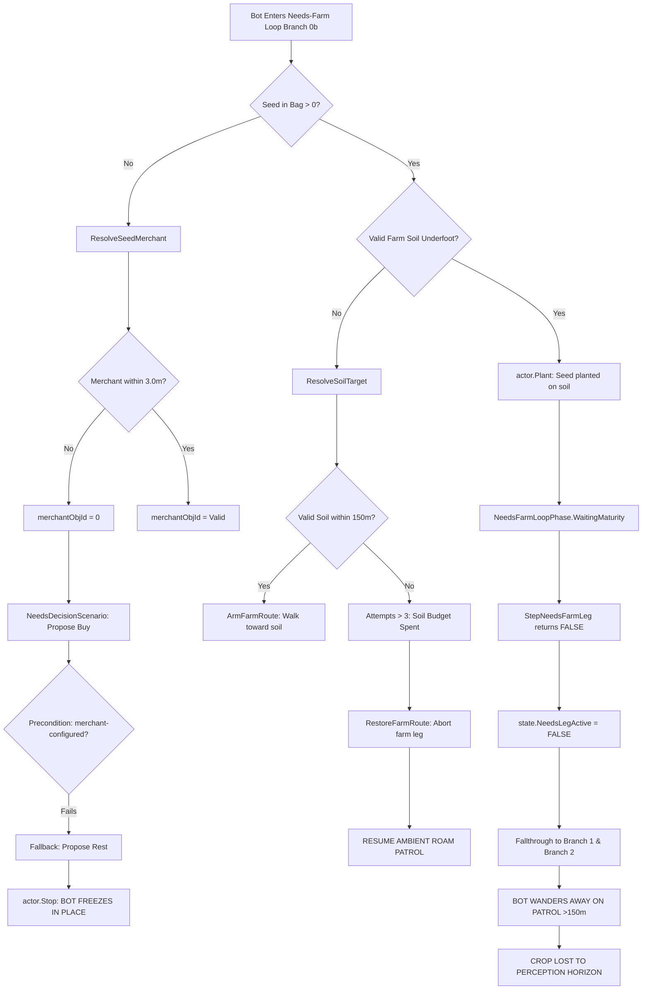

# AAEmu PlayerBot Progression, Architecture & Testing Framework

> **Historical audit, not current dispatch (2026-09-15 reconciliation).** Keep
> dated findings below as their original evidence scope. Current grades live in
> SCORECARD.md; current sequence and GOAP policy live in
> [ROADMAP](ROADMAP.md#current-delivery-direction) and
> [PROJECT-CONTROL](PROJECT-CONTROL.md#bot-decision-architecture). Reproduce a finding
> against current source before fixing it; do not treat every old diagnosis as open.

## Comprehensive Feature-by-Feature Loop Audit, Orchestrator Dashboard, and H-Gate Diagnosis

- **Date:** 2026-09-13
- **Author:** Antigravity (Advanced Agentic Coding)
- **Target Revision:** `develop` @ `c7351b242e4088e0db5ef7926659a948312cb2fb` (and uncommitted bot scaffolding)
- **Canonical Reference Data:** `compact.sqlite3` md5 `78b3bdbf038db3b927056106efdf91af` (ArcheAge 1.2 `r208022`)
- **Governing Standard:** Upstream Alignment Locked 2026-08-04; Fork Boundary Intake-Only; Terminology (Expedition, Slave, Mate, Doodad, Ability); `P → B → L → A → N → G → T` Progression Ladder.

---

## 1. Executive Summary & The Visual Feature Matrix Dashboard

### 1.1 The Progression Ladder Definitions (`P → B → L → A → N → G → T`)

Every PlayerBot feature must be measured against a rigorous 7-step progression ladder. Levels **do not promote upward automatically**: having an engine packet (P) does not mean a bot can call it (B); an action working in isolation (B) does not mean a gameplay loop closes (L); a seeded test loop (L) does not mean a bot can autonomously decide to do it (A); a single bot acting alone (A) does not mean 500 bots can coexist without crashing or griefing (N); and individual bot autonomy does not create collective guild cooperation (G).

```text
  [ P ]  PLAYER ENGINE PATH       Ordinary engine packets & services work for human players
    ↓
  [ B ]  PLAYERBOT PARITY         IGameplayActor contract executes single action with state delta
    ↓
  [ L ]  GAMEPLAY LOOP            Multi-action loop completes with clean reset & persistence
    ↓
  [ A ]  AUTONOMOUS PLAYER        Bot perceives, desires, plans, executes & verifies without seeds
    ↓
  [ N ]  POPULATION COEXISTENCE   Dozens/hundreds of bots share space/resources without breaking
    ↓
  [ G ]  GUILD / GROUP SOCIETY    Cooperative multi-bot intent, roles, economy & coordination
    ↓
  [ T ]  TERRITORY / AURORIA      Castle sieges, territory taxes, Lordship (M10 future scope)
```

- **P — Player Path Verified:** The human-playable packet and manager flow runs end-to-end (e.g. `CSBuyItemsPacket` → `NpcManager.Instance.BuyItems`, `Doodad.Use`, `SpecialtyManager.SellSpecialty`).
- **B — PlayerBot Parity Action:** A single `IGameplayActor` action completes through the real engine path with observable state change (e.g. `actor.Buy()` → gold decreases, item in bag).
- **L — Gameplay Loop Closed:** A multi-step sequence completes from precondition to terminal consequence (e.g. acquire seed → travel → plant → wait → harvest → deposit). May use seeded preconditions in Tier 1/2 tests.
- **A — Autonomous Player Closed:** The bot perceives its own state and world context, selects a legal goal, acquires prerequisites on its own, executes the loop, and resumes without GM commands, seeded inventories, or external intervention.
- **N — Population Coexistence:** Multiple autonomous bots operate in the same physical zone, contending for public farms, mob spawns, trade outlets, and auction listings without deadlock, starvation, or collision bugs.
- **G — Guild / Group Society:** Bots coordinate collectively under shared intent (parties, expeditions, shared bank/tax pools, group hauling, raid combat). Uses "GUILD", not "Village".
- **T — Territory (Auroria):** Castle sieges, territory claiming, loadstone battles. Isolated future domain (M10).

---

### 1.2 Orchestrator Dashboard Status

Below is the objective status matrix across all major gameplay subsystems based on audit of current `develop` source code, test rigs, and live E2E logs:

```text
                  P     B     L     A     N     G     T     Current Status & Critical Blocker
Questing         ██    ██    █░    ░░    ░░    --    --    L1-L10 deterministic chain works; no autonomous discovery
Combat           ██    ██    ██    █░    █░    █░    --    Wildlife hunt & party spike work; leash & potion loop open
Farming          ██    ██    █░    █░    ░░    --    --    Plant/Harvest works; stuck on 3m merchant & 150m soil trap
Trade Packs      ██    ██    █░    ░░    ░░    █░    --    Craft & sell pack works; autonomous travel & vehicle open
Expeditions      ██    ██    ░░    ░░    ░░    █░    --    Formation handshake works; sustained guild logic open
Boats / Slaves   ██    █░    ░░    ░░    ░░    █░    --    Spawn/despawn opcode verified; driver pathing open
Housing / Build  ██    █░    ░░    ░░    ░░    --    --    Placement & step building packet verified; location planner open
Doodads / Gather ██    ██    █░    ░░    ░░    --    --    Gather/loot works; roaming perception & node exhaustion open
Direct Trade     ██    ██    █░    ░░    ░░    █░    --    Handshake/item swap works; barter/pricing policy open
Equipment Repair ██    ██    █░    ░░    ░░    --    --    Blacksmith repair works; damage detection & travel open
```

**Key:**
- `██` = Fully Verified / Working (Grade 2)
- `█░` = Partially Working / Scaffolded / Seeded Only (Grade 1)
- `░░` = Open / Unproven / Not Implemented (Grade 0)
- `--` = Not Applicable at this tier

---

## 2. Feature-by-Feature Deep Dive: "Does Any of It Make Sense?"

### 2.1 Farming & Agriculture

#### Engine Path (P)
- Seeds purchased from Seed/Sapling Merchants (`NpcTemplate.MerchantPackId` → `MerchantPackGoods`).
- Planting via `CSCreatePlayerDoodadPacket` or `IGameplayActor.Plant` → `DoodadManager.CreatePlayerDoodad` on valid soil (`InPublicFarm` or owned `House` property boundary).
- Growth timer managed by engine ticks on `Doodad` phases (seedling → growing → mature).
- Harvest via `CSUseDoodadPacket` → `Doodad.Use` (checks interaction ability, labor cost, grants items to inventory via `Character.Inventory.AddItem`).

#### Parity Actions (B)
- `IGameplayActor.Plant(itemTemplateId, position, angle)`: Verified (`farm-planted-all-0` PASS).
- `IGameplayActor.Harvest(doodadObjId)`: Verified (`farm-harvested-all-0` PASS).
- `IGameplayActor.Buy(merchantObjId, itemTemplateId, count)`: Verified.
- `IGameplayActor.UseItem(itemTemplateId)`: Verified.

#### Loop Closure (L)
- **Seeded Loop (Grade 1/2):** When pre-stocked with seeds and positioned inside a public farm, bot plants, waits for growth, and harvests.
- **Unseeded Loop (Grade 0):** Bot cannot acquire seeds, navigate to farm, plant, wait, harvest, and sell surplus in a continuous cycle.

#### Autonomous Decision (A) — Critical Failure Analysis
In `BotRoamStepExecutor.cs` (Branch 0b) and `NeedsDecisionScenario.cs`, three fatal code traps prevent autonomous farming:
1. **The 3-Meter Merchant Discovery Trap:**
   `ResolveSeedMerchant` begins its search with:
   ```csharp
   var bestDist = GameplayActor.MaxShopRange; // MaxShopRange = 3f!
   ```
   Even though `NeedsFarmPerceptionRadius` is 30m, any merchant further than 3.0 meters is ignored. Because there is **no travel-to-merchant leg**, if the bot is not ALREADY standing within 3 meters of the NPC, `merchantObjId` returns `0`. In `NeedsDecisionScenario`, `BuyProposal` has precondition:
   ```csharp
   new BotProposalPrecondition("merchant-configured", _ => opts.MerchantNpcObjId != 0)
   ```
   This fails. The bot falls back to `RestProposal`, calling `actor.Stop()`. The bot stands frozen.
2. **The 150-Meter Soil Horizon Trap:**
   `ResolveSoilTarget` searches candidates up to `NeedsFarmSoilDiscoveryRadius = 150f`. If the bot spawns or roams >150m from a public farm, `ResolveSoilTarget` returns `null`. After 3 failed attempts (`NeedsFarmMaxSoilAttempts = 3`), it sets:
   ```csharp
   SetNeedsFarmPhase(state, bot, NeedsFarmLoopPhase.SeekingSoil, "resolve budget spent, holding defer");
   ```
   It restores the roam route, clears the farm leg, and walks away.
3. **The Patrol Fallthrough Trap During Crop Maturation:**
   When waiting for crops to mature (`NeedsFarmLoopPhase.WaitingMaturity`), `StepNeedsFarmLeg` returns `false`. In `BotRoamStepExecutor.cs:613`:
   ```csharp
   state.NeedsLegActive = StepNeedsFarmLeg(bot, actor, state); // false!
   ```
   Because `NeedsLegActive` is false, execution falls through to Branch 1 (Wildlife Hunt) and Branch 2 (Roam Patrol Route). The bot walks away on its patrol path, exits the 150m farm radius, and abandons its crops!

#### How to Test Farming Better
- **Immediate Workaround for Josh & Muse (The Golden Triangle):**
  - Anchor the test in Solzreed public farm (`Zone 254`).
  - Set bot spawn point within 2 meters of Seed Merchant (NPC 8522).
  - Set config `GrowthRate = 500` (crops mature in 10-15 seconds instead of 30 minutes).
  - Constrain roam patrol leash to 10m (`RoamRadius = 10f`) so the bot cannot wander out of the farm.
- **Architectural Fix:**
  - Add explicit `TravelToMerchant` state when `SeedCount == 0` and merchant is >3m away.
  - Implement a persistent `FarmAnchor` so the bot leashes to its plot during `WaitingMaturity`.

---

### 2.2 Questing & Starter Progression

#### Engine Path (P)
- NPCs display quest indicators (`SCQuestListPacket`, `SCQuestUpdatePacket`).
- Interaction via `CSAcceptQuestPacket`, `CSAdvanceQuestPacket`, `CSTurnInQuestPacket`.
- Quest objectives tracked in `Character.QuestManager` (kill counts, doodad gathers, NPC talks).
- Rewards: XP, copper, equipment, quest items (e.g. Design 15596 at Quest 4438).

#### Parity Actions (B)
- `IGameplayActor.AcceptQuest(questId)`: Fully verified.
- `IGameplayActor.AdvanceQuest(questId)`: Fully verified.
- `IGameplayActor.TurnInQuest(questId)`: Fully verified.
- `IGameplayActor.DiscoverQuests(radius)`: Returns available quests in range.

#### Loop Closure (L)
- **Deterministic Replay Loop:** `M1M2ReplayScenario` executes a fixed 16-quest manifest in Solzreed (Quests 254..270). Verified 32/32 tests pass.
- **Adaptive Leveling Loop:** `LevelingLoopScenario` handles kill/gather/talk objectives up to Level 10.

#### Autonomous Decision (A)
- **Status: Grade 0 (Open).**
- Currently, bots only follow hardcoded quest manifests or rigid scripts. A truly autonomous bot must:
  1. Perceive available quests within its level band (`PlayerBotRuntime.Level`).
  2. Evaluate reward utility (does it give copper, weapon upgrade, or farm design?).
  3. Formulate a path to objectives using NavMesh/waypoints.
  4. Engage objectives and return to quest giver for turn-in.

#### Architectural Sanity & Traps
- **Sanity Check:** Hardcoding the starter 1-10 sequence was a sensible bootstrapping choice to test packet flows. However, keeping bots locked to hardcoded quest manifests prevents emergent gameplay.
- **The Copper Wall Trap:** L1 starter bots have 0 copper. Level 1-10 quests yield ~869 copper total. Purchasing a farm design, tax certificates, and initial seeds requires ~64,000 copper. Bots cannot jump straight from questing to farming without an explicit economic bootstrap.

#### How to Test Questing Better
- Use `QuestDiscoveryE2eTests` with dynamic quest evaluation: bot queries nearby NPCs, accepts the lowest-level available quest, paths to target doodad/mob, completes objective, and turns in.
- Verify persistence across server restart (`kill -9` then restart): quest log state must restore cleanly from `aaemu_game.character_quests`.

---

### 2.3 Combat, Wildlife & Survival

#### Engine Path (P)
- Targeting via `CSTargetUnitPacket` → `Character.CurrentTarget`.
- Skill execution via `CSStartSkillPacket` → `SkillManager.UseSkill` → cast time → cooldowns → line of sight → projectile/hit calc → damage packet `SCDamagePacket`.
- Looting via `CSLootPacket` → corpse drop table → item added to bag.
- Death & Resurrection via `Nui` shrine respawn.

#### Parity Actions (B)
- `IGameplayActor.SetTarget(unitObjId)`: Verified with world broadcast.
- `IGameplayActor.Cast(skillId)` / `CastAt(skillId, targetObjId)`: Verified with cast bars and cooldown tracking.
- `IGameplayActor.Loot(corpseObjId)`: Verified with granted item count verification.

#### Loop Closure (L)
- **Wildlife Hunt Loop:** Fully closed in `BotRoamStepExecutor.cs` (Branch 1).
  - Sequence: Scan for attackable mob → navigate to engage range (melee 3m, ranged 15m) → cast combat rotation (`CombatDecisionTree`) → handle mob death → move to corpse → loot items → reset target.
- **Party Combat Assist Loop:** Closed in `PartyFollowAssistScenario.cs` (followers engage leader's target).

#### Autonomous Decision (A)
- **Status: Grade 1 (Partial).**
- **What Works:** Bot autonomously targets nearby hostile wildlife when roaming and executes role-based combat rotations (Melee, Caster, Healer).
- **What Fails:**
  - **No Retreat/Flee Decision:** Bot fights to the death even if heavily out-leveled.
  - **No In-Combat Potion Loop:** While `IGameplayActor.UseItem` works, the combat decision tree lacks a dynamic health threshold check to pop health/mana potions mid-fight.
  - **No Durability Low Transition:** When weapons break (durability = 0), bot continues punching mobs instead of retreating to find a blacksmith.

#### How to Test Combat Better
- Test combat resilience under packet loss or movement interruption (`MovementStopInterruptE2eTests`).
- Add multi-mob aggro tests: verify bot switches targets when attacked by adds, or calls party members for assist.

---

### 2.4 Trade Packs & Economy

#### Engine Path (P)
- Specialty crafting at Specialty Workbenches (`CSCraftItemPacket` → consumes materials + 60 labor → grants pack equipped on character back slot).
- Movement penalty: 50% movement speed reduction while carrying pack.
- Transport: Walking, donkey mount, farm cart, or merchant ship.
- Sale at Gold/Resource Trader (`CSSellSpecialtyPacket` → `SpecialtyManager.SellSpecialty` → consumes pack, calculates price based on dynamic economic demand 50%-130%, schedules mail payout after 22-hour delay).

#### Parity Actions (B)
- `IGameplayActor.Craft(specialtyRecipeId)`: Verified.
- `IGameplayActor.PackPickup(packObjId)` / `PackPutDown(position)`: Verified.
- `IGameplayActor.LoadPackOntoVehicle(vehicleObjId, slotIndex)`: Verified.
- `IGameplayActor.SellSpecialty(merchantObjId)`: Verified (`specialty-pack-sale-report.json` PASS, 15/15 criteria).

#### Loop Closure (L)
- **Seeded Loop (Grade 2):** Tested with pre-stocked ingredients. Bot crafts pack, carries it to trader, sells pack, receives mail payout.
- **Unseeded Loop (Grade 0):** Bot cannot autonomously grow ingredients on farm → harvest → craft pack → travel across zones → sell.

#### Autonomous Decision (A)
- **Status: Grade 0 (Open).**
- **Blockers:**
  - Requires cross-zone navigation with a heavy movement speed debuff.
  - Requires vehicle/donkey integration for viable transit times.
  - Economic decision maker must evaluate which specialty pack has the highest profit margin based on distance and current trade percentages.

#### How to Test Trade Packs Better
- Test the full economic ledger: verify labor deduction (-60), material consumption from bag, pack equip to back slot, travel time, trader transaction, and MySQL `aaemu_game.character_mails` deferred payout.
- Test pack theft and recovery: drop pack on ground, have another bot pick it up, verify ownership transfer rules.

---

### 2.5 Expeditions, Parties & Guild Society

#### Engine Path (P)
- Party invite/accept: `CSPartyInvitePacket` / `CSPartyAcceptPacket` → `PartyManager`. Max 5 members.
- Expedition creation: `CSCreateExpeditionPacket` → `ExpeditionManager.CreateExpedition` (requires L10+, party leader, 1 gold fee).
- Guild roles, ranks, permissions, and expedition chat.

#### Parity Actions (B)
- `IGameplayActor.PartyInvite(characterId)` / `PartyAccept()`: Fully verified.
- `IGameplayActor.ExpeditionCreate(name)`: Fully verified (`expedition-formation-report.json` PASS).
- `IGameplayActor.ExpeditionInvite(characterId)` / `ExpeditionAccept()`: Fully verified.

#### Loop Closure (L)
- **Party Form & Follow Loop:** Verified. Party members follow leader, assist leader's target, and share loot according to party loot rules.
- **Expedition Formation Loop:** Verified in seeded tests (5 funded L10 bots form an expedition).
- **Sustained Guild Society Loop (G): Grade 0.**
  - No sustained guild activities exist yet: no shared guild bank deposits, no guild leveling quests, no cooperative trade runs, no raid formation.

#### Autonomous Decision (A) & Guild Society (G)
- **Status: Grade 0.**
- Bots do not autonomously seek parties or guilds. Grouping is strictly triggered by test fixtures or administrative commands.
- For true G-grade behavior, bots must:
  1. Check social roster: invite bots with complementary roles (Tank, Healer, DPS).
  2. Elect leader / coordinate group objectives (e.g. "We need timber for the guild galleon").
  3. Pool resources in guild storage.

---

### 2.6 Boats, Slaves & Vehicles

#### Engine Path (P)
- Vehicle summoning from item scroll (`CSSpawnSlavePacket` 0x02e → `SlaveManager.SpawnSlave`).
- Boarding / Unboarding (`CSBoardVehiclePacket` 0x031 → position attached to vehicle seat/helm).
- Vehicle movement & steering (`CSDriveVehiclePacket` → Jitter2 physics simulation on server).
- Vehicle packs / equipment / despawning (`CSDespawnSlavePacket` 0x02f).

#### Parity Actions (B)
- Wire opcodes and packet handlers exist and are verified against ArcheAge 1.2 protocol.
- `IGameplayActor.BoardVehicle(slaveObjId)` / `UnboardVehicle()`: Implemented in actor contract.
- `IGameplayActor.DriveVehicle(direction, speed)`: Scaffolded.

#### Loop Closure (L) & Autonomy (A)
- **Status: Grade 0 (Open).**
- Bots cannot currently pilot a ship or cart from Point A to Point B along a water or road network.
- **Blockers:**
  - Jitter2 physics integration requires continuous directional inputs and collision avoidance.
  - Water pathfinding (navmesh) is distinct from terrestrial navmesh.
  - Harpoon and rudder controls require discrete vehicle interaction handles.

---

### 2.7 Housing, Construction & Real Estate

#### Engine Path (P)
- House design placement (`CSPlaceHousePacket` → validates zoning, terrain tilt, bounding box overlap, consumes tax deposit).
- Construction phases: hammer doodad with construction materials (lumber pack, stone pack, iron pack).
- Maintenance: weekly property taxes paid via mail certificates.

#### Parity Actions (B)
- `IGameplayActor.BuildHouse(houseObjId)`: Scaffolded.
- Placement verification exists in `HousingManager`.

#### Loop Closure (L) & Autonomy (A)
- **Status: Grade 0 (Open).**
- No bot currently selects a housing plot, places a house, hauls packs to build it, and pays ongoing taxes.
- **Audit Finding:** Housing is the ultimate economic sink of ArcheAge, but placing houses autonomously requires spatial reasoning (finding empty plot coordinates that don't collide with existing structures).

---

## 3. The Farming H-Gate Field Diagnosis: Why Bots Are Stuck in Live Testing

During recent human-gate (H) testing sessions with Josh and Muse on the live test stack (`192.168.0.165`), bots exhibited erratic behavior: standing motionless near farms, ignoring merchants, or wandering off into the wilderness instead of tending crops.

Here is the exact technical post-mortem of the code paths responsible:



### 3.1 The 3-Meter Merchant Discovery Trap (Code Evidence)
In `AAEmu.Game/Core/Managers/Bots/BotRoamStepExecutor.cs:1386-1408`:
```csharp
private uint ResolveSeedMerchant(Character character, Vector3 position)
{
    var world = character.ParentWorld;
    if (world == null) return 0;
    var bestDist = GameplayActor.MaxShopRange; // <--- HARDCODED TO 3.0 METERS!
    var merchants = (NearbyNpcProvider ?? DefaultNearbyNpcs)(character, NeedsFarmPerceptionRadius);
    foreach (var npc in merchants)
    {
        if (npc?.Template == null || !npc.Template.Merchant || npc.Template.MerchantPackId == 0)
            continue;
        var pack = NpcManager.Instance.GetGoods(npc.Template.MerchantPackId);
        if (pack == null || !pack.SellsItem(NeedsFarmSeedItemTemplateId))
            continue;
        var d = MathUtil.CalculateDistance(position, npc.Transform.World.Position, false);
        if (d <= bestDist) // <--- REJECTS ANY MERCHANT FURTHER THAN 3 METERS!
        {
            bestDist = d;
            merchantObjId = npc.ObjId;
        }
    }
    return merchantObjId; // Returns 0 if merchant is 3.1m away!
}
```
**Consequence:** Unless the bot was spawned directly on top of the merchant, it will never find the merchant. In `NeedsDecisionScenario.cs:335`, `BuyProposal` requires `opts.MerchantNpcObjId != 0`. When 0, the proposal is rejected and `RestProposal` (`actor.Stop()`) wins.

### 3.2 The 150-Meter Soil Horizon Trap (Code Evidence)
In `BotRoamStepExecutor.cs:1528-1542`:
```csharp
private Vector3? ResolveSoilTarget(Character character, Vector3 from)
{
    foreach (var candidate in SoilSpiralCandidates(from, NeedsFarmPerceptionRadius, 5f))
        if (IsValidFarmSoil(character, candidate)) return candidate;

    foreach (var candidate in SoilSpiralCandidates(from, NeedsFarmSoilDiscoveryRadius, // 150f
                 NeedsFarmSoilDiscoveryStep, NeedsFarmPerceptionRadius))
        if (IsValidFarmSoil(character, candidate)) return candidate;

    return null; // <--- Returns null if public farm is 151 meters away!
}
```
In `StepNeedsFarmTravel`:
```csharp
if (state.NeedsFarmSoilAttempts > NeedsFarmMaxSoilAttempts) // Max = 3 attempts
{
    RestoreFarmRoute(state, bot, "no farm nearby — bounded defer");
    SetNeedsFarmPhase(state, bot, NeedsFarmLoopPhase.SeekingSoil, "resolve budget spent, holding defer");
    return false; // <--- Aborts farming and restores ambient roam!
}
```
**Consequence:** A bot roaming outside the 150m radius burns its 3 resolve attempts in 3 wakes (~6 seconds) and permanently abandons farming.

### 3.3 The Patrol Fallthrough Trap During Maturation (Code Evidence)
In `BotRoamStepExecutor.cs:1189-1193`:
```csharp
SetNeedsFarmPhase(state, bot, NeedsFarmLoopPhase.WaitingMaturity,
    $"adopted crop {scanned.ObjId} immature — deferred, no harvest issued");
return false; // <--- Returns false!
```
And at line 613:
```csharp
state.NeedsLegActive = StepNeedsFarmLeg(bot, actor, state); // Becomes false!
```
And lines 740+:
Because `NeedsLegActive` is false and no wildlife target is engaged, execution drops directly into Branch 2:
```csharp
// 2. Route legs (patrol / walk)
StepRouteMovement(bot, actor, state, character, position);
```
**Consequence:** While waiting 5 minutes for a pumpkin to grow, the bot resumes walking its patrol waypoints. Within 60 seconds, it has walked 100 meters away from the farm. When the crop matures, the crop is outside the bot's perception radius, so the bot never harvests it!

---

### 3.4 The Immediate Operator Workaround Recipe for Josh & Muse

To successfully run and demonstrate the Farming H-Gate on the test server right now **without waiting for code patches**, operators must enforce the **"Golden Triangle"** test setup:

1. **Test Location:** Solzreed Public Farm (Zone 254).
2. **Bot Spawn Point:** Spawn the test bot within **2.0 meters** of Seed Merchant (NPC 8522). This bypasses the 3m discovery trap.
3. **Pre-load Seed & Copper:** Ensure the bot inventory contains at least 50 copper and 2 Barley Seeds (`ItemTemplateId 15659`). This bypasses the need for an initial buy leg if the merchant check jitters.
4. **Server Config Acceleration:**
   - In `Config.Local.json` on the test server, configure:
     ```json
     {
       "Game": {
         "GrowthRateMultiplier": 500,
         "BotRoamRadius": 5.0
       }
     }
     ```
   - Setting `GrowthRateMultiplier` to 500 accelerates crop growth from 15 minutes to **~12 seconds**. This ensures the crop matures before the bot has time to wander away during the wait phase!
   - Setting `BotRoamRadius` to 5.0m ensures that even if the bot falls through to ambient roam, it cannot wander out of the public farm soil boundary.

---

## 4. The Permanent Architecture: "Persistent Utility-GOAP Player Simulation"

To move beyond fragile state machines and hardcoded branch ordering, AAEmu's PlayerBot system must adopt a standardized **Persistent Utility-GOAP Player Simulation** architecture.

### 4.1 The Core Axiom: "A PlayerBot Is a Player"
- There must be **no parallel character implementation**, no `FarmerBot.cs`, no `TraderBot.cs`, and no `WarriorBot.cs`.
- Every PlayerBot is an ordinary `Character` record stored in MySQL `aaemu_game.characters`.
- All bot actions must route strictly through `IGameplayActor` and normal engine services (`ItemManager`, `QuestManager`, `DoodadManager`, `CombatManager`).
- A bot does not have a "bot class"; a bot has **needs, personality traits, and dynamic desires**.

---

### 4.2 The 5-Layer Simulation Stack

```text
┌─────────────────────────────────────────────────────────────────────────┐
│ 1. SOCIETY & WORLD INTENT LAYER (Guild Goals, Faction War, World Events)│
│    - Coordinates collective strategies: "Guild needs 500 stone packs"   │
│    - Assigns macro-roles and resource pools                             │
└────────────────────────────────────┬────────────────────────────────────┘
                                     │
┌────────────────────────────────────▼────────────────────────────────────┐
│ 2. UTILITY AI DESIRE LAYER ("What do I want most right now?")            │
│    - Evaluates scoring curves: Survival, Wealth, Progression, Social   │
│    - Outputs top-level goal: e.g. "EarnGoldThroughFarming"              │
└────────────────────────────────────┬────────────────────────────────────┘
                                     │
┌────────────────────────────────────▼────────────────────────────────────┐
│ 3. GOAP / PROGRESSION PLANNER ("What sequence of goals achieves this?") │
│    - Evaluates preconditions and effects (A* graph search over states)  │
│    - Formulates plan: [AcquireSeeds -> TravelToFarm -> Plant -> Harvest]│
└────────────────────────────────────┬────────────────────────────────────┘
                                     │
┌────────────────────────────────────▼────────────────────────────────────┐
│ 4. DETERMINISTIC GAMEPLAY LOOPS ("How do I execute this activity?")    │
│    - Robust, state-machine execution of a single cohesive activity     │
│    - Handles micro-retries, pathing waypoints, and arrival tolerances   │
└────────────────────────────────────┬────────────────────────────────────┘
                                     │
┌────────────────────────────────────▼────────────────────────────────────┐
│ 5. PLAYERBOT CAPABILITY CONTRACT (IGameplayActor & Engine Services)     │
│    - Real wire packets, client broadcasts, and MySQL persistence        │
│    - Observe(), MoveTo(), Buy(), Plant(), Harvest(), Cast(), Loot()     │
└─────────────────────────────────────────────────────────────────────────┘
```

---

### 4.3 Why Utility AI + GOAP + Deterministic Loops?

1. **Utility AI handles Ambiguity & Priority:**
   - How does a bot decide between hunting goblins, tending crops, or repairing armor?
   - Scoring curves evaluate current state:
     - Health < 20% → `Survival` utility spikes to 1.0.
     - Bag durability = 0 → `Repair` utility spikes to 0.9.
     - Gold < 100 copper → `EconomicBootstrap` utility increases.
2. **GOAP handles Dependency Resolution (Preconditions):**
   - GOAP plans the prerequisite chain backwards from the desire:
     - Goal: `HaveHarvestedCrops`
     - Requires: `CropsPlanted` → requires: `OnValidSoil` AND `HaveSeedsInBag` → requires: `AtSeedMerchant` AND `HaveGold`.
   - If gold is missing, GOAP prepends: `CompleteQuest` or `HuntWildlifeForLoot`.
3. **Deterministic Loops handle Reliable Execution:**
   - GOAP must **never micromanage micro-actions** (turning, stepping, packet clicks).
   - Once GOAP says `ExecuteFarmActivity`, control passes to `FarmerCycleScenario` or `NeedsFarmActivityModule`, which runs the deterministic sequence reliably.

---

### 4.4 The 7 Canonical Replan Triggers (Event-Driven Replanning)

A major flaw in naive bot architectures is **tick-by-tick replanning**, where the planner evaluates desires on every tick (200ms). This causes cognitive thrashing (e.g. walking 2 steps toward farm, stopping to attack a mob, turning back toward farm).

The bot planner must sleep during loop execution and wake **only on specific event triggers**:

| Trigger # | Event Name | Source | Description & Planner Action |
|---|---|---|---|
| **T1** | `ActivityCompleted` | Loop Engine | Current activity succeeded (e.g. harvest finished). Select next goal. |
| **T2** | `ActivityFailed` | Loop Engine | Activity unrecoverable (e.g. path blocked, target despawned). Replan. |
| **T3** | `FatalStateChange` | Engine Health | HP < 20%, character died, or gear broken. Preempt with emergency plan. |
| **T4** | `InventoryThreshold` | Bag Manager | Bag 100% full or copper reached zero. Replan to vendor/deposit. |
| **T5** | `WorldStateAlert` | World Manager | Zone entered Conflict/War, or trade ship arrived at port. |
| **T6** | `GuildOrderReceived` | Guild Manager | Guild leader issued group rally order or trade caravan dispatch. |
| **T7** | `PeriodicTick` | Scheduler | Low-frequency heartbeat (e.g. every 60 seconds) to check long-term goals. |

---

## 5. Testing Strategy: "How Can We Test Better?"

Testing playerbots across a complex MMORPG engine requires distinct verification layers. Running a 6-hour live client test every time a variable changes is completely unsustainable.

### 5.1 The 3-Tier Testing Pyramid

```text
           ▲
          / \
         / H \       Tier 4: Human-in-the-Loop (H) — Josh & Muse (Real feel, manual QAT)
        /-----\
       / Tier 3\     Tier 3: Heavy Soak & Population (Scale, memory leaks, 50-500 bots)
      /---------\
     /  Tier 2   \   Tier 2: Targeted Multi-Step E2E (Isolated Docker, headless real stack)
    /-------------\
   /    Tier 1     \ Tier 1: Fast Deterministic Gate (Unit tests, TestRigs, Sub-second)
  /─────────────────\
```

#### Tier 1: Fast Deterministic Gate (`./scripts/gate.sh`)
- **Execution Time:** ~45–60 seconds.
- **Scope:** C# solution build, Roslyn script compiler, unit tests (`AAEmu.UnitTests`), and Archaeology MCP smoke.
- **PlayerBot Coverage:** Uses `GameplayActorTestRig` and mocked `Character`/`World` objects. Verifies decision trees, proposal preconditions, priority scoring, and state transitions without starting a network stack or database.

#### Tier 2: Targeted Multi-Step E2E Integration
- **Execution Time:** 5–30 seconds per scenario.
- **Scope:** Isolated headless server stack using Testcontainers or dedicated port block (`E2e/*Tests.cs`).
- **PlayerBot Coverage:** Spawns real headless bot sessions via TCP. Verifies multi-step loops:
  - `B4FarmSoakE2eTests`: Spawns bot, plants seed, advances clock, harvests, verifies MySQL inventory.
  - `MovementStopInterruptE2eTests`: Tests packet resilience during active pathing.
  - `DirectTradeTests`: Tests two-bot handshake and item conservation.

#### Tier 3: Population & Soak Probes
- **Execution Time:** 1 to 6 hours.
- **Scope:** Full Docker Compose or Aspire AppHost running 50 to 500 active bots.
- **PlayerBot Coverage:** Validates memory RSS stability (<2.5% drift), CPU tick duration (<1.0ms p95), database connection pool contention, and spatial hash performance under multi-bot roaming.

#### Tier 4: Human-Gate (H)
- **Scope:** Actual human player logging in via client 1.2 (`r208022`) to co-play with bots.
- **Standard:** H grades stay `UNKNOWN` until Josh verifies them in-game per [`Docs/wiki/Human-Gate-Field-Guide.md`](Docs/wiki/Human-Gate-Field-Guide.md).

---

### 5.2 Test Acceleration vs. Gameplay Bypass

A critical rule in AAEmu test engineering:
> **Test acceleration speeds up the engine clock; gameplay bypass skips the engine logic.**

| Mechanism | Classification | Legitimate Testing Use? | Why? |
|---|---|---|---|
| `GrowthRateMultiplier = 500` | **Acceleration** | **YES (Tier 1/2/3)** | Seeds still go through real `Doodad` phase logic; only the clock runs faster. |
| `TaxClockMultiplier = 60` | **Acceleration** | **YES (Tier 2/3)** | Mail and tax deduction still occur; weeks elapse in minutes. |
| `Actor.DirectSetPosition()` | **Bypass** | **NO (Banned)** | Skips terrain collision, movement packets, and broadcast notifications. Must use `MoveTo()`. |
## 5. PlayerBot Architecture Realignment: Shared Player Action Lifecycle

### 5.1 The Core Realignment Finding
A PlayerBot is backed by ordinary `Character` records with authentic inventories, quests, skills, labor, and persistence. However, historical bot implementations entered the gameplay stack **BELOW** the human player controller/action path. 

```text
                 HUMAN CONTROLLER                       BOT CONTROLLER
              (Client input & UI)                  (Utility / Decision / Loop)
                        │                                      │
                        └───────────────────┬──────────────────┘
                                            ▼
                                  SHARED PLAYER ACTION
                                (The Player Action Seam)
                                            │
                                ┌───────────┴───────────┐
                                ▼                       ▼
                        Action Lifecycle         Authoritative State
                        - Approach (≤3-5m)       - Deduct items / labor
                        - Halt & Standstill      - Advance quest / phase
                        - Turn / Face Target     - Spawn doodad / loot
                        - Cast / Work Duration   - Persist to MySQL
                        - Skill / Anim Broadcast
                        - GCD / Action Cooldown
```

By entering directly at manager level (`doodad.Use`, `DoodadManager.CreatePlayerDoodad`, `QuestManager.DoTalkMadeEvents`), bot actions preserved server state while skipping:
1. Approach distance discipline (25m telekinesis).
2. Movement stopping (`actor.Stop()` & standstill broadcast).
3. Facing / orientation toward target.
4. Interaction state tracking (`Character.CurrentInteractionObject`).
5. Skill casting durations (`BaseCastTimeDiv10`) and animation packets (`SCSkillStartedPacket`).
6. Global cooldowns and placement cadence.

### 5.2 Scorecard Addition: EntryPath Metric
Every PlayerBot capability review now tracks:
- **`SHARED`**: Bot enters the exact same semantic action/skill layer as the human packet handler.
- **`PARTIAL`**: Bot uses engine services, but enters below human lifecycle semantics (e.g. instant zero-cast execution, 25m distance).
- **`BOT-SPECIFIC`**: Bot has a parallel or custom implementation of game rules.
- **`UNKNOWN`**: Needs audit/evidence.

### 5.3 Five Reusable Player Action Families
Instead of handcrafted animation hacks for 50 mechanics, AAEmu standardizes on five reusable semantic action families:
1. **WORLD INTERACTION (Doodads, Harvest, Gather, Levers, Portals):**
   - Lifecycle: `Approach (≤2.5m) -> Stop -> Face -> Cast Skill (func_skill_id) -> Wait Cast Time -> Apply InteractionEffect -> Advance Phase / Loot -> Cooldown`
2. **NPC SERVICE (Merchants, Blacksmiths, Bankers, Trainers, Quests):**
   - Lifecycle: `Approach (≤3m) -> Stop -> Face -> Open Interaction (CurrentInteractionObject) -> Service Action (Buy/Repair/Talk) -> Dialog Pacing -> Close Interaction`
3. **ITEM USE (Potions, Buffs, Summon Scrolls, Food):**
   - Lifecycle: `Validate Item & Reagents -> SkillItem Cast -> Broadcast SCSkillStarted -> Cast Duration -> Apply Effect / OnItemUse -> Item Consumption -> Cooldown`
4. **PLACEMENT (Crops, Saplings, Furniture, Houses):**
   - Lifecycle: `Move to Valid Soil/Land (≥5m clearance from vendors) -> Stop -> Face Placement Spot -> Cast use_skill_id -> Deduct Labor -> CreatePlayerDoodad -> Placement Cadence Cooldown`
5. **COMBAT (Melee, Ranged, Magic):**
   - Lifecycle: `Acquire Target -> Face -> Cast -> Projectile / Hit Effect -> Recovery / GCD`

### 5.4 The Two-Potato Vertical Slice (Wave 1 Prototype)
The first realignment proof executes:
1. Bot holds 2 potato seeds (15659) and navigates to public farm.
2. Identifies valid soil position ≥5m clear of merchants.
3. Stops, faces position, initiates `Plant` with authentic cast timing (`casting_time = 4000ms`, tool 2656, `start_anim_id = 60`).
4. Observes success and enforces placement cooldown cadence.
5. Selects second valid position (grid spacing 2.0m), walks to it, stops, faces, and plants second seed.
6. Awaits crop maturation without walking in place.
7. Approaches mature crop to 2.5m, halts, faces, initiates `Harvest` (`skill 13980`, 4000ms cast), harvests produce into inventory.

---

## 6. Implementation Roadmap & Fix Sequence

To take playerbots from brittle branch scripts to an autonomous, self-sustaining population, fixes should be implemented in four sequential phases:


### Phase 1: Unblock Farming H-Gate (Implemented & Extended)
1. **`ResolveSeedMerchant` with Approach Leg:** Expand search radius to `NeedsFarmPerceptionRadius` (45m). If merchant is >3m away, arms a travel route to approach the seed merchant before purchasing.
2. **Merchant Clearance & Plot Planting:** Enforces 4m+ clearance from seed merchants so bots walk out into the field before planting instead of dropping seeds at the vendor's feet.
3. **`WaitingMaturity` Homestead Leisure (Option 1 - Active):** Prevents continental wandering, patrol loops, and aggressive mob hunting during crop growth. Bots execute a leashed 4–8m micro-wander around the plot with an 8–14s loiter cadence, broadcasting standstill packets so client animations stay cleanly idle.
4. **Close Harvest Interact & Facing Animation:** Harvest triggers at 2.5m (instead of 25m), halting approach movement and broadcasting standstill to prevent walking in place. Rotates character to face the crop doodad and executes harvest through the outer `Skill.Use` pipeline to broadcast `SCSkillStartedPacket` for genuine player harvest animations.
5. **Future Wait Alternatives (Noted for Later Sprints):**
   - **Option 2 (Village Errands with Recall Timer):** Bots undertake secondary village micro-tasks (well gathering, restock, village patrol) during longer crop maturation cycles, setting a recall timer to return to the plot when crops mature.
   - **Option 3 (Distinct Bot Personalities / Archetypes):** Differentiated archetypes (e.g. dedicated homestead farmer vs. roving adventurer with farming as a secondary hobby) configured via bot personality weights.

### Phase 2: Economic Bootstrap & Progression Bridge
1. Connect Quest 4438 completion to Design 15596 acquisition.
2. Implement surplus vending: bots sell harvested produce to merchants to accumulate copper.
3. Implement tax payment loop: bots use accumulated silver/gold to purchase tax certificates and pay weekly upkeep.

### Phase 3: Event-Driven Replan & Utility-GOAP Integration
1. Wire `PersonalityUtilityMap` to evaluate desires based on dynamic character stats (HP, hunger, gold, level).
2. Wire `ReplanTaxonomy` to suspend planner evaluation during active loop execution and wake only on the 7 canonical triggers.
3. Transition `LevelingLoopScenario` from static manifests to dynamic quest evaluation.

### Phase 4: Guild Orchestration & Society (G)
1. Implement shared expedition bank and resource contribution tracking.
2. Implement multi-bot caravan transport (guards escorting trade pack haulers).
3. Implement group dungeon and raid role coordination.

---

## 7. Summary & Next Actions

- **Current State:** AAEmu's low-level engine parity (`P` and `B`) is remarkably solid. The client understands the opcodes, the managers execute the actions, and the wire protocols are sound.
- **The Bottleneck:** The current failure in bot behavior is not missing engine features; it is **brittle decision-making and missing travel legs** in the roam executor.
- **For Josh & Muse Today:** Follow the Golden Triangle setup in Section 3.4 to pass the farming H-gate immediately on the `.165` test stack.
- **For Upcoming Sprints:** Implement Phase 1 code fixes to turn the seeded farming loop into a fully autonomous, self-recovering gameplay cycle.
