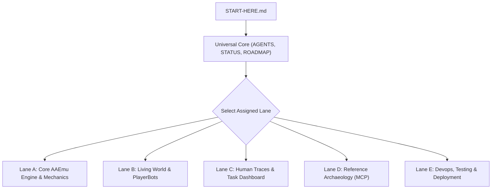

# START HERE — Agent Onboarding & Domain Lane Dispatcher

Last refreshed: 2026-09-15 · branch of record: `develop` (`joshhmann/AAEmu`) · HEAD: `2ef3d2fbb`

This document is the **single authoritative router** for agents and developers entering this repository. It tells you what to read, what to ignore, which domain lane to enter, and where active backlogs and verification gates live.

---

## 1. What This Repo Is

Open-source **ArcheAge 1.2** (`r208022`) server emulator in .NET 10 (`AAEmu.Login`, `AAEmu.Game`, shared `AAEmu.Commons`). 
* **Product Doctrine:** *The living world is the feature; PlayerBots are just the mechanism that gives it life.*
* **Milestone Horizon:** M8 (Living Village) → M9 (Emergent world systems) → M10 (Territory & siege).
* **Topology:**
```text
Dev box (/root/aaemu-dev, origin = writable fork)
  ──push──►  GitHub fork develop (joshhmann/AAEmu — source of truth)
  ──fetch/merge──►  Testing server .165 (/root/AAEmu, runs docker compose)
Upstream AAEmu/AAEmu: intake-only. NEVER push a branch or open a PR there.
```

---

## 2. Non-Negotiables (Violate These and the PR is Rejected)

1. **Fork Boundary is Permanent:** Upstream push URL is `DISABLED`. Upstream updates arrive only on `sync/upstream-YYYY-MM-DD` branches, verified, and merged into the fork.
2. **`H` Means Josh Playing:** Bot and scripted evidence is `A` (automated), never `H`. `H` stays `UNKNOWN` until Josh verifies human feel in-game (`SCORECARD.md`). Never average grades; weakest required dimension wins.
3. **Evidence Before Claims:** Every Tier 1/2/3 report MUST carry: exact SHA, command, build/compiler result, unit total/pass/fail/skip counts, and MCP smoke status.
4. **`compact.sqlite3` is Read-Only Reference:** (Canonical md5 `78b3bdbf038db3b927056106efdf91af`, 679 tables). Mutable state goes to MySQL (`aaemu_game` / `aaemu_login`). Never `Prepare()` a parameterless MySQL statement (connector-net race bug).
5. **Config Precedence:** `Config.json` → `Configurations/*.json` → `Config.Local.json` (wins, gitignored). Never place machine-specific hosts/secrets in shared config.
6. **Match the Neighbors:** New code must mirror neighboring patterns. No second conventions. Use official game terminology (Doodad, Mate, Slave, Transfer, Expedition, Ability, ActAbility).

---

## 3. The Gateway: Universal Onboarding (Read by ALL Agents)

Every agent, regardless of task or subagent role, must review these 4 foundational documents first:

| Order | Document | Purpose |
| :---: | :--- | :--- |
| **1** | [`START-HERE.md`](file:///root/aaemu-dev/START-HERE.md) | **This router:** Architecture, non-negotiables, and domain lane selection. |
| **2** | [`AGENTS.md`](file:///root/aaemu-dev/AGENTS.md) | **Core rules:** Workflows, coding conventions, packet offset maps, and gate policies. |
| **3** | [`STATUS.md`](file:///root/aaemu-dev/STATUS.md) | **Live pulse:** Current checkpoint, active human gates, and today's changes. |
| **4** | [`ROADMAP.md`](file:///root/aaemu-dev/ROADMAP.md) & [`progression-board.md`](file:///root/aaemu-dev/scorecard-explorations/progression-board.md) | **Macro progress:** M1–M10 status and overall milestone deliverables. |

---

## 4. Domain Lanes (Pick Your Lane)

Select the domain lane that matches your current assignment:



---

### Lane A: Core AAEmu Engine & Mechanics
* **Agent Role:** Core server engineer working on packets, combat math, NPC behaviors, doodad scripts, quests, housing, trade packs, netcode, or MySQL schemas.
* **Prerequisite Reading:**
  * Architecture: [`Docs/wiki/Components.md`](file:///root/aaemu-dev/Docs/wiki/Components.md)
  * Conventions: [`Docs/wiki/Development-Conventions.md`](file:///root/aaemu-dev/Docs/wiki/Development-Conventions.md)
  * Network/Offsets: [`AAEmu.Login/Docs/networking.md`](AAEmu.Login/Docs/networking.md), [`AAEmu.Game/Core/Packets/CSOffsets.cs`](file:///root/aaemu-dev/AAEmu.Game/Core/Packets/CSOffsets.cs), [`SCOffsets.cs`](file:///root/aaemu-dev/AAEmu.Game/Core/Packets/SCOffsets.cs)
* **Where Unfinished Work Lives:**
  * [`scorecard-explorations/zero-wired-domains.md`](file:///root/aaemu-dev/scorecard-explorations/zero-wired-domains.md) — Unimplemented client packets and unwired opcodes.
  * [`scorecard-explorations/partial-domains.md`](file:///root/aaemu-dev/scorecard-explorations/partial-domains.md) — Half-built mechanics and missing formulas.
* **Code Scope:**
  * Inbound/Outbound Packets: `AAEmu.Game/Core/Packets/{C2G,G2C}/`
  * Managers: `AAEmu.Game/Core/Managers/` (must register in `Program.cs`)
  * Data Loaders: `AAEmu.Game/GameData/`
  * Domain Models: `AAEmu.Game/Models/Game/`
  * Schemas: `SQL/updates/` + base `SQL/aaemu_{login,game}.sql` (both required!)
* **Verification Gate:**
  * `./scripts/gate.sh` (fast gate)

---

### Lane B: Living World & PlayerBots
* **Agent Role:** AI & simulation engineer working on autonomous bot decision trees, combat rotations, leveling loop, dormancy/restoration, scheduling, bot GM commands, and town presence.
* **Prerequisite Reading:**
  * Master Architecture: [`PLAYERBOT_TARGET_ARCHITECTURE_CONSOLIDATED_V1.md`](file:///root/aaemu-dev/PLAYERBOT_TARGET_ARCHITECTURE_CONSOLIDATED_V1.md)
  * Framework: [`PLAYERBOT_PROGRESSION_AND_TESTING_FRAMEWORK.md`](file:///root/aaemu-dev/PLAYERBOT_PROGRESSION_AND_TESTING_FRAMEWORK.md)
  * Vision: [`LIVING-WORLD.md`](file:///root/aaemu-dev/LIVING-WORLD.md)
  * **Rule #9 & #10:** PlayerBots compose around normal `Character` records and standard gameplay services. NEVER create parallel character, inventory, or quest implementations!
* **Where Unfinished Work Lives:**
  * [`scorecard-explorations/playerbot-blockers.md`](file:///root/aaemu-dev/scorecard-explorations/playerbot-blockers.md) — Active and historical architectural blockers (PB-001 through PB-006).
  * [`scorecard-explorations/deferred-not-now.md`](file:///root/aaemu-dev/scorecard-explorations/deferred-not-now.md) — Explicit backlog of parked features (Sections 12–18: Village errands, multi-objective quests, food/potion consumption, knockback recovery, mount riding, party assists, roster generation).
  * [`scorecard-explorations/mechanics/playerbot-capability-matrix.md`](file:///root/aaemu-dev/scorecard-explorations/mechanics/playerbot-capability-matrix.md) — Full/Partial/Missing capability matrix.
* **Code Scope:**
  * Bot Brain & Loop: `AAEmu.Game/Core/Managers/Bots/` (`CombatDecisionTree`, `GameplayActor`, `DormantBotRegistry`, `LevelingLoopScenario`)
  * GM Commands: `AAEmu.Game/Scripts/Commands/BotCmd.cs`, `AAEmu.Game/Scripts/SubCommands/Bots/`
  * Unit Tests: `AAEmu.UnitTests/Game/Core/Managers/Bots/`
* **Verification Gate:**
  * `./scripts/gate.sh BotActionControllerRouteTests` (targeted)
  * `./scripts/gate.sh` (full suite)

---

### Lane C: Human Action Traces & Task Dashboard
* **Agent Role:** Tooling & telemetry engineer creating task specifications, capturing empirical ground truth, running trace coverage analysis, and maintaining the web dashboard on port 8085.
* **Prerequisite Reading:**
  * Specification & Evaluation Standard: [`Scripts/playertrace-coverage/TASK_SPEC_AND_EVALUATION_GUIDE.md`](file:///root/aaemu-dev/Scripts/playertrace-coverage/TASK_SPEC_AND_EVALUATION_GUIDE.md)
  * Tooling Architecture: [`Scripts/playertrace-coverage/README.md`](file:///root/aaemu-dev/Scripts/playertrace-coverage/README.md)
* **Where Unfinished Work Lives:**
  * [`playertrace-coverage/dashboard_tasks.json`](file:///root/aaemu-dev/playertrace-coverage/dashboard_tasks.json) — Live catalog of 31 tasks; check tasks with `"status": "Pending"`.
  * Web Dashboard: Run `python3 Scripts/playertrace-coverage/dashboard_server.py --port 8085` and browse to `http://<ip>:8085`.
  * Roadmap & Scorecard tab maintenance contract (mandatory whenever roadmap/scorecard records change): [`Scripts/playertrace-coverage/DASHBOARD_MAINTENANCE.md`](file:///root/aaemu-dev/Scripts/playertrace-coverage/DASHBOARD_MAINTENANCE.md)
* **Tools & In-Game Actions:**
  * In-Game: `/trace start <scenario>` → execute action → `/trace stop`
  * Trace Evaluator: `python3 Scripts/playertrace-coverage/task_evaluator.py --task-id <id>`
  * Coverage Analysis: `python3 Scripts/playertrace-coverage/playertrace_coverage.py traces/player-actions --out playertrace-coverage`
* **Verification Gate:**
  * `python3 Scripts/playertrace-coverage/test_coverage_mapper.py`

---

### Lane D: Reference Archaeology (Archaeology MCP)
* **Agent Role:** Reverse engineer or data analyst querying canonical ArcheAge 1.2 reference data (`compact.sqlite3`, 679 tables, md5 `78b3bdbf038db3b927056106efdf91af`) to corroborate formulas, item stats, NPC spawn templates, and client facts before writing code.
* **Prerequisite Reading:**
  * MCP Server README: [`AAEmu.ArchaeologyMcp/README.md`](file:///root/aaemu-dev/AAEmu.ArchaeologyMcp/README.md)
  * Data Source Inventory: [`scorecard-explorations/mechanics/archaeology-data-source-inventory.md`](file:///root/aaemu-dev/scorecard-explorations/mechanics/archaeology-data-source-inventory.md)
  * Acceptance Dossier: [`scorecard-explorations/mechanics/archaeology-mcp-acceptance.md`](file:///root/aaemu-dev/scorecard-explorations/mechanics/archaeology-mcp-acceptance.md)
* **Workflow:**
  1. Catalog first: `list_sources` / `list_tables` / `describe_table`
  2. Corroborate facts: `query_sql` / `lookup_row`
  3. Relationship trace: `trace_skill`, `trace_item`, `trace_quest`, `trace_npc`, `find_quest_objectives`
* **Verification Gate:**
  * `./scripts/archaeology-cycle.sh` (MCP build + 156 archaeology tests + 24-tool smoke)

---

### Lane E: Devops, Testing & Deployment
* **Agent Role:** Systems engineer configuring developer environments, running .NET Aspire or host MySQL, running heavy integration/soak gates, and staging deployments to the `.165` test server.
* **Prerequisite Reading:**
  * Guided Setup: [`.agents/skills/aaemu-setup/SKILL.md`](file:///root/aaemu-dev/.agents/skills/aaemu-setup/SKILL.md)
  * Aspire Guide: [`Docs/wiki/Aspire-Development-Guide.md`](file:///root/aaemu-dev/Docs/wiki/Aspire-Development-Guide.md)
  * Deployment Playbook: [`WORKFLOW.md`](file:///root/aaemu-dev/WORKFLOW.md)
  * Human Gate Field Guide: [`Docs/wiki/Human-Gate-Field-Guide.md`](file:///root/aaemu-dev/Docs/wiki/Human-Gate-Field-Guide.md)
  * Soak Test Manual: [`Docs/wiki/Soak-Runs.md`](file:///root/aaemu-dev/Docs/wiki/Soak-Runs.md)
* **Verification Gates:**
  * Fast Gate: `./scripts/gate.sh` (~1 min)
  * Targeted E2E: `dotnet test AAEmu.IntegrationTests/AAEmu.IntegrationTests.csproj --treenode-filter "..."`
  * Heavy Soak / Exit Gate: Unfiltered `AAEmu.IntegrationTests` (35–45+ min)

---

## 5. Summary Index of Tracking & Planning Documents

| Category | File | Description |
| :--- | :--- | :--- |
| **Rules & Workflow** | [`AGENTS.md`](file:///root/aaemu-dev/AGENTS.md) | Universal agent rules, coding style, git boundaries. |
| **Rules & Workflow** | [`WORKFLOW.md`](file:///root/aaemu-dev/WORKFLOW.md) | Branching, commits, deployment, rollback recipes. |
| **Roadmap & Progress** | [`ROADMAP.md`](file:///root/aaemu-dev/ROADMAP.md) | M1 through M10 macro requirements and exit criteria. |
| **Roadmap & Progress** | [`ROADMAP_SCORECARD_SUMMARY.md`](file:///root/aaemu-dev/ROADMAP.md) | see ROADMAP.md / SCORECARD.md for milestone completion state. |
| **Roadmap & Progress** | [`scorecard-explorations/progression-board.md`](file:///root/aaemu-dev/scorecard-explorations/progression-board.md) | Master board tracking status of all sub-lanes and open gates. |
| **Backlog & Future Tasks**| [`scorecard-explorations/deferred-not-now.md`](file:///root/aaemu-dev/scorecard-explorations/deferred-not-now.md) | Parked features & revisit triggers (Sections 1–18). |
| **Backlog & Future Tasks**| [`playertrace-coverage/dashboard_tasks.json`](file:///root/aaemu-dev/playertrace-coverage/dashboard_tasks.json) | 31 concrete in-game tasks with checklists and packet specs. |
| **Gaps & Defects** | [`scorecard-explorations/playerbot-blockers.md`](file:///root/aaemu-dev/scorecard-explorations/playerbot-blockers.md) | Architectural blockers (PB-001 through PB-006). |
| **Gaps & Defects** | [`scorecard-explorations/zero-wired-domains.md`](file:///root/aaemu-dev/scorecard-explorations/zero-wired-domains.md) | Catalog of unimplemented wire packets and missing systems. |
| **Gaps & Defects** | [`scorecard-explorations/partial-domains.md`](file:///root/aaemu-dev/scorecard-explorations/partial-domains.md) | Mechanics with incomplete logic or missing persistence. |
| **Vision & Concepts** | [`LIVING-WORLD.md`](file:///root/aaemu-dev/LIVING-WORLD.md) | Blueprint for living bot societies, trade, and economy. |
| **Vision & Concepts** | [`PROJECT-CONTROL.md`](file:///root/aaemu-dev/PROJECT-CONTROL.md) / [`VISION.md`](file:///root/aaemu-dev/VISION.md) | Target user experience, core pillars, and project scope. |
| **World & Reference** | [`Docs/wiki/World-Continents-Races-and-Mirage-Isle.md`](file:///root/aaemu-dev/Docs/wiki/World-Continents-Races-and-Mirage-Isle.md) | World zones, races, NPC distributions, islands & Mirage Isle architecture. |
