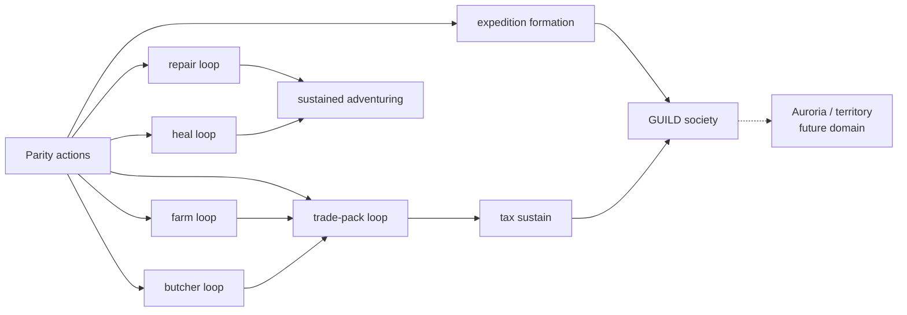

# PlayerBot progression ladder — P → B → L → A → N → G → T (2026-09-13)

Canonical, concise grading frame for PlayerBot work. Planning + docs only: no engine/behavior
change, no test change, no milestone rewrite. Living Village keeps its name; new coordination
language uses GUILD, not village. Auroria/territory is a separate future domain (T only).

Provenance: docs HEAD `c7351b242e4088e0db5ef7926659a948312cb2fb` (2026-09-12 reconciliation);
E2E evidence reports at the same revision (E2E evidence dir `/root/aaemu-e2e/logs/`, not in-repo);
contract/branch sources at committed HEAD (`IGameplayActor.cs`, `GameplayActor.cs`,
`BotRoamStepExecutor.cs`). Grades follow [SCORECARD.md](../../SCORECARD.md) conventions
(U/0/1/2/N-A; never average; weakest required dimension wins; every non-U grade links its
evidence; H stays U until Josh runs the curated scenario).

Why a new doc (not an extension): the [capability matrix](playerbot-capability-matrix.md) is a
Perceive/Decide/Act/Verify per-system table, not a ladder; the
[progression audit](playerbot-progression-audit-2026-09-12.md) and
[fresh-bot-to-farm audit](fresh-bot-to-farm-audit-2026-09-12.md) are dated audits preserved
verbatim; the authoritative records stay lean per the [PROJECT-CONTROL update
protocol](../../PROJECT-CONTROL.md) (affected rows only, no second narrative). This one focused
doc holds the ladder; the records link here.

## 1. The ladder

- **P — PLAYER (ordinary engine path exists).** The human-playable path runs end-to-end
  through normal gameplay services/packets (e.g. `Character.DoRepair`, `SkillItem` use,
  `Doodad.Use`, `SpecialtyManager`, `TradeManager`, `ExpeditionManager`). P=2 means the
  wired path is evidenced; it says nothing about bots.
- **B — PLAYERBOT PARITY (one contract action works).** A single `IGameplayActor` action
  completes through the real path with observable state change (e.g. `Repair` Completed +
  durability delta, `UseItem` Completed + HP delta). B=2 means action-works; it is not a loop.
- **L — GAMEPLAY LOOP (named loop closes).** The [loop-closure DoD](../../PROJECT-CONTROL.md)
  holds: explicit clean/reset or documented precondition, ordinary player-facing path, expected
  world/client result, persistent/terminal consequence, plus repeat/restart/error invariants
  where the contract requires. Seeded preconditions are allowed; the acceptance path has no
  intervention. L=2 names its seeded scope; a lone action leg is at most L=1.
- **A — AUTONOMOUS PLAYER (bot closes the loop alone).** The bot perceives, chooses a legal
  goal/action, executes through ordinary services, verifies the outcome, and resumes — with no
  human, GM/admin, direct-DB/state, `Transform`/`ZoneId`, or manual-state intervention, and no
  quest-event injection, runtime mutation, GM repair, or ordinary-path bypass. A=2 requires this
  closure; fixture-seeded runs never qualify.
- **N — POPULATION (many bots coexist at scale).** N counts scale/coexistence, not features:
  bots share farms, markets, and routes without contamination, inside the closed A3/A5 tiers.
  A 5-bot formation run does not evidence N.
- **G — GUILD / GROUP SOCIETY (sustained coordination).** Parties, expeditions, and later
  guilds operate over time: recruit, role, share, persist, recover. Forming (one `Create`) is a
  B/L prerequisite, never G closure. New coordination language uses GUILD.
- **T — TERRITORY (Auroria / siege future domain).** Control, siege, and territory economy.
  Separate future domain ([ROADMAP M10](../../ROADMAP.md)); nothing in this doc advances or
  grades T beyond N/A.

**Non-implication rule.** Levels do not promote upward: P=2 does not imply B=2; B=2 (action
works) does not imply L=2 (loop closes); a seeded L=2 does not imply A (autonomous closure);
one formed expedition does not imply G; no population run implies T. Each level needs its own
evidence. **FIXTURE PREREQUISITE ≠ AUTONOMOUS ACQUISITION** (stocked seeds/money/levels prove
subsystems only). **TEST ACCELERATION ≠ GAMEPLAY BYPASS** (GrowthRate/tax-timer knobs speed the
engine path; they never substitute for earning, traveling, or deciding).

## 2. Sprint classification (verified against the cited evidence file; no inflated grades)

H=U everywhere (no human/client-feel claim). N/G/T are N/A with reason except Expedition→G=0.

| Feature | Evidence (verified this session) | P | B | L | A | N / G / T | Action-vs-loop note |
|---|---|---|---|---|---|---|---|
| Recovery / Healing | `recovery-heal-report.json`: PASS; wound 720→1, potion 8515 (skill 11715, fixed heal 990) via real `GameplayActor.UseItem` restores 1→991 (+990); legs provision / rig-potion / wound / heal all PASS | 2 | 2 | 1 | 0 | N/A (single-bot leg; scale/guild/territory out of scope) | Heal **action works**; combat→wound→recognize→heal→resume **loop open** (potion stocked, no acquire/recognize/resume proof) |
| Equipment Repair | `economy-repair-report.json`: PASS; sword 5639 durability 10→65 at spawned smith 10997 via real `GameplayActor.Repair` (`repair Completed`); legs rig-damaged / blacksmith / repair / durability all PASS | 2 | 2 | 1 | 0 | N/A (same reason) | Repair **action works**; damage→recognize→travel→repair→resume **loop open** (damage seeded, smith spawned, itemId threaded) |
| Specialty Pack Sale | `specialty-pack-sale-report.json`: PASS, 20/20 traces, 15/15 criteria (payout mail 124540c == formula, labor −60, ledger/labor/seed conservation) | 2 | 2 | 2 (seeded-loop scope only) | 0 | N/A (single-cycle scope) | Seeded **loop closes** (rig: L10, 100k money, stocked inputs); autonomous earn→acquire→trade→tax-funding **chain unproven** |
| Direct Trade | `trade-handshake-report.json`: PASS; OFFER→PUTUP→LOCK×2, alice 1→0 / bob 0→1 conservation | 2 | 2 | 1 | 0 | N/A (handshake scope; G out of scope) | Item **handshake works**; earn→meet→swap→verify→resume **loop open**, currency leg open; v1 auto-accepts (consent is controller policy) |
| Livestock Butcher | `agriculture-butcher-report.json`: PASS; calf planted → cow phase 5782 → butchered 5790 → loot tail 9907, beef 8048 ×14; grow leg ~30 s (accelerated) | 2 | 2 | 1 | 0 | N/A (single-animal leg) | Butcher **action works**; raise→recognize-mature→travel→butcher→sustain **loop open** (calf stocked, growth accelerated — labeled, not bypassed) |
| Expedition Formation | `expedition-formation-report.json`: PASS; party invite/accept ×4 then `ExpeditionCreate` → expedition 1000, owner-membered + all 5 share expedition | 2 | 2 | 1 (seeded formation) | 0 | N=N/A (single formation, not scale); **G=0** (formation ≠ sustained GUILD operation); T=N/A (Auroria future domain) | Formation **action works** from seeded L10/funded party; autonomous grouping decision + operate/persist/recover **open** |
| Plant | Same pack-sale criteria `farm-planted-all-0` PASS (2/2, seed 15659 → doodad 2259) + `IGameplayActor.Plant` real path (`CreatePlayerDoodad`) | 2 | 2 | 2 (seeded plant→grow→harvest scope) | 0 | N/A | Plant **leg works** inside seeded cycle; autonomous earn-seed→travel→plant→sustain **driver unproven** |
| Harvest | Same criteria `farm-harvested-all-0` PASS (phase 4457 → deleted, yields 6+4) + `GameplayActor.Harvest` data-driven path (real `Doodad.Use`) | 2 | 2 | 2 (same seeded scope) | 0 | N/A | Harvest **leg works**; autonomous plot/target selection + sustain **unproven** |
| needs.farm driver | No live E2E report. Code: `NeedsFarmActivityModule` (`needs.farm`), `NeedsDecisionScenario` (Harvest-vs-Buy-vs-Rest), executor branch 0b; rig: `BotNeedsEvaluatorTests`, `NeedsFarmModuleTests` | N/A (decision layer, no player counterpart) | 1 (rig-routed only; live wake drive unproven) | 0 | 0 | N/A | Tier-0 driver is library + arbiter wiring; autonomous needs→work→verify **loop unproven** (blocked by PB-FARM-01: 3m merchant range check, 150m soil horizon, and maturation patrol fallthrough; see `PLAYERBOT_PROGRESSION_AND_TESTING_FRAMEWORK.md`) |

Ledger cross-check (no grade changes claimed here): COMBAT-01 note already records the heal leg
with no grade change; REPAIR-01 stands W=2/A=2; TRADE-01 A=2 item-handshake/currency-open;
EXPEDITION-01 A=2 formation; FARM-01/PACK-01 keep their standing grades — the seeded scopes above
do not promote any autonomous-loop claim.

## 3. Loop dependency map (committed sources; dependency direction, not a plan)

Parity capabilities (committed `IGameplayActor` surface: `Observe`, `MoveTo`/`NavigateTo`/
`NavigateToUnit`/`MoveToUnit`, `SetTarget`, `Cast`/`CastAt`, `Interact`/`InteractWith`, `Loot`,
`UseItem`, `PartyInvite`/`PartyAccept`, `ExpeditionCreate`/`Invite`/`Accept`/`Leave`,
`TradeOffer`/`Putup`/`LockOk`, `Mount`/`Dismount`, `Board`/`UnboardVehicle`, `Harvest`, `Craft`,
`DriveVehicle`, `PackPickup`/`PutDown`, `LoadPackOntoVehicle`, `Plant`, `BuildHouse`,
`Deposit`/`Withdraw`, `Accept`/`Advance`/`TurnInQuest`, `DiscoverQuests`, `Buy`/`Sell`/
`SellSpecialty`, `Repair`) unlock loops as follows. Committed `BotRoamStepExecutor` branch
order gates composition: **0 party → 0 conflict-PvP → 0b needs-farm** (preempts
wildlife/butcher/route; never party/PvP/quest) **→ 1 wildlife hunt → 1b butcher → 2 route legs
→ 3 tick → 4a/4b ground/broadcast**.

- **repair loop** — `Observe` durability → recognize low → `NavigateTo` smith → `Repair`
  (`Character.DoRepair`) → verify delta → resume. Unlocks sustained adventuring, not autonomy.
- **heal loop** — `Observe` HP → `UseItem` potion (SkillItem branch) → verify HP delta → resume
  (restock open). Unlocks combat sustain.
- **farm loop** — `Buy` seeds → `Plant` (`CreatePlayerDoodad`) → `Observe` maturity → `Harvest`
  (phase-func `Doodad.Use`) → `Deposit` → replant → conservation verify. Unlocks food/material
  income and the pack chain's input.
- **butcher loop** — `Plant` calf → `Observe` phase → `Interact` (butcher skill) → `Loot` tail →
  verify beef count. Unlocks food/material income alongside farming.
- **trade-pack loop** — farm/butcher yield → `Craft` pack → `PackPickup`/`PutDown` →
  `BoardVehicle` → `LoadPackOntoVehicle` → `DriveVehicle` → `Unboard` → unload → `SellSpecialty`
  (packet → `SpecialtyManager`, mail payout + labor) → `Deposit` → ledger verify. Unlocks
  recurring income toward tax; needs farm + hauler legs composed.
- **expedition loop** — `PartyInvite`/`Accept` ×N → `ExpeditionCreate` → shared-membership verify
  → operate/persist/recover (open). Unlocks the G prerequisite (formation), not G itself.

## 4. Golden-playerbot north-star (dependency direction, NOT an implementation plan)

L1 spawn (ordinary `Character` record, class gear, no copper) → discover offerings in band →
accept lowest-level legal quest → pursue (kill/gather/interact legs) → turn in (copper +
supplies) → repeat Solzreed → Dewstone at L10+ → complete quest 4438 (L7, NPC 9789) for design
15596 → buy seeds (15659, merchant 8522) → plant on public farms first (no design/tax/labor) →
grow → harvest → deposit → replant → fund 50,000 copper/week tax through trade packs (124,540
after 22h mail delay) → sustain. Copper wall (~869 starter-band copper vs ~64,000+ design +
first tax + deposit) forces progression past L10 questing into vending and trade — the
dependency the audits record ([progression audit](playerbot-progression-audit-2026-09-12.md) §2–§4,
[tiered audit](fresh-bot-to-farm-audit-2026-09-12.md) Tier 0–2). Each arrow is a prerequisite
direction (trade presumes farm yield; tax presumes recurring income; GUILD presumes formed,
funded bots); sequencing and build order are explicitly out of scope here.

**Broke-bot economic policy stays deferred** to autonomy/progression work: the rig's broke-bot
leg (no money → harvest-only work) proves legality-before-preference in isolation, not a live
livelihood policy. No starvation, begging, sharing, or guild-welfare rule is set by this doc.
